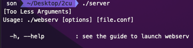

# How to run the implemented project?

Just compile the project with the given Makefile.
> make

Originally, the program takes only an argument to run. Or, it shows the guide to run the program like the picture below. Thus, configure the configuration file before run the server.

    

ex)
> ./server config/default.conf

You can change the config file as you want by referring to the following

# What kind of directives this Web Server handles?

Every directive except `location` directive cannot be specified under `location` directive. (Inside `location` is ok.)

(1) workers : number of worker thread

    e.g.) workers number;

(2) server_name : specification the server name on the server block directive

    e.g.) server_name name1 name2 name3 ...;

(3) listen : bind the address and the port as specified (default is 0.0.0.0:8000)

    e.g.) listen address[:port];
    e.g.) listen port;

(4) root : the root directory to handle the request

    e.g.) root directory_path;

(5) auth : authentication on the specific uri, must match given information

    e.g.) auth login:password;

(6) upload : the directory path to upload the files

    e.g.)upload directory;

(7) autoindex : options to list the files automatically when there's no matching uri (default is off)

    e.g.) autoindex on_or_off;

(8) index : files to be served as index (multiple files can be specified)

    e.g.) index file1 file2 file3 ...;

(9) error_page : the default error_pages to serve based on the given status codes

    e.g.) error_page status_code1 status_code2 status_code3 ... uri;

(10) cgi-bin : default cgi binary searching directory (default values is cgi-bin)

    e.g.) cgi-bin directory_path_based_on_root_directive;

(11) cgi : cgi binary to deal with the file which ends with specific extension

    e.g.) cgi extension cgi_path;

(12) location : set the path to handle specific uri from the server

    e.g.) location [ = | ~ | ~* | ^~ ] uri;

To test the some part of this web server, access `localhost:8000` which is run by `./config/default.conf` or make your own config(.conf) file would be a great choice.

# Example
1. Type http://localhost:8000 in the Firefox address bar
2. You can login with below info
- Current login credentials:
    "Jose" "1234"
    "Mahirah" "1234"
    "Woomin" "1234"
    "Owen" "1234" (admin)
3. You can take a look at the site that we made as an example.

Our project was to create a web server, not a website. Therefore, the HTML code we made as an example only showed that the web server was operating normally. Therefore, there is no point in trying to find a vulnerability in the HTML file. Our vulnerability lies within the code that implements the web server.
